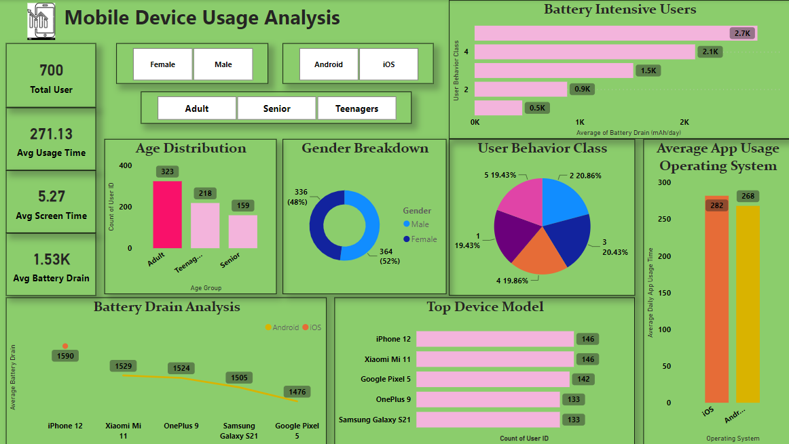

# Mobile-Device-Usage-Analysis (Interactive Dashboard creation using Power BI)

## **Project Objective**

Analyzing mobile device usage patterns to understand user behavior, data usage, and battery consumption trends. This analysis aimed to provide actionable insights into improving user experience, optimizing app performance, and identifying potential opportunities for targeted product enhancements
## **Dataset used**
- <a href="https://github.com/Ryaz16/Mobile-Device-Usage-Analysis/blob/main/user_behavior_dataset.csv"> Mobile Device Usage  Data</a>

## **Questions (KPIs)**

KPIs Observed in Mobile Device Usage Analysis
Total Users: 700 users.
Average Usage Time: 271.13 minutes/day.
Average Screen Time: 5.27 hours/day.
Average Battery Drain: 1.53K mAh/day.
Age Group Distribution:
Adults: 323 users.
Teenagers: 218 users.
Seniors: 159 users.
Gender Breakdown:
Female: 52%.
Male: 48%.
Battery-Intensive Users:
Class 5 users consume the highest battery (2.7K mAh/day).
Average App Usage Time by OS:
iOS: 282 minutes/day.
Android: 268 minutes/day.
Top Devices:
Most popular: iPhone 12, Xiaomi Mi 11, Google Pixel 5.
Data Usage Patterns:
Higher number of apps installed correlates with increased data usage.
User Behavior Class Distribution:
Class 5: 20.86%.
Class 4: 19.86%.
App Usage vs. Screen Time:
Positive correlation between screen-on time and app usage time.

## **Process**

- Verify data for any missing values and anomalies, and sort out the same.
- Make sure data is consistent and clean with respect to data type, data format and values used.

## **Dashboard**

## **Project Insight**

The Power BI dashboard provided clear, actionable insights:

Stakeholders identified the most battery-intensive devices (iPhone 12).
Gender and age-wise patterns informed app design customization (e.g., focusing on adult users).
The scatter plot on data usage by the number of apps installed helped identify heavy app users for targeted offers.
Simplified decision-making for marketing strategies and device-specific optimization.
Your work highlighted your ability to use data visualization tools effectively to communicate complex datasets in an easy-to-understand manner

